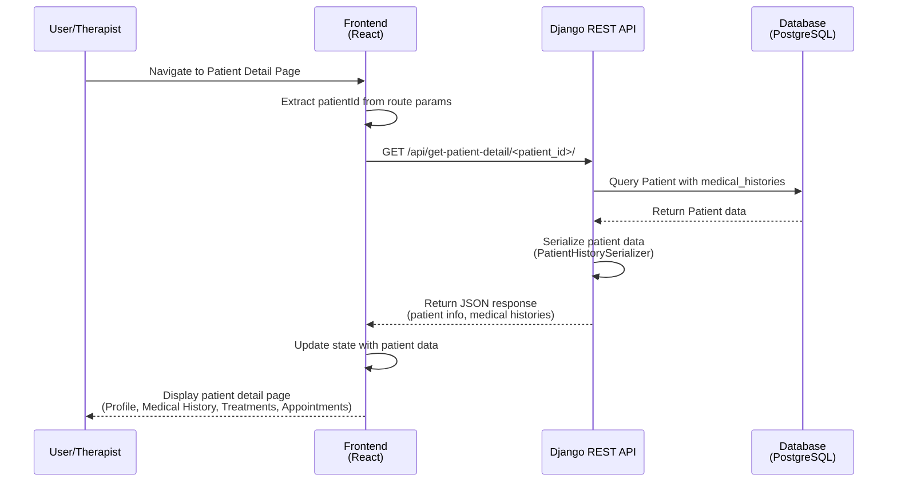
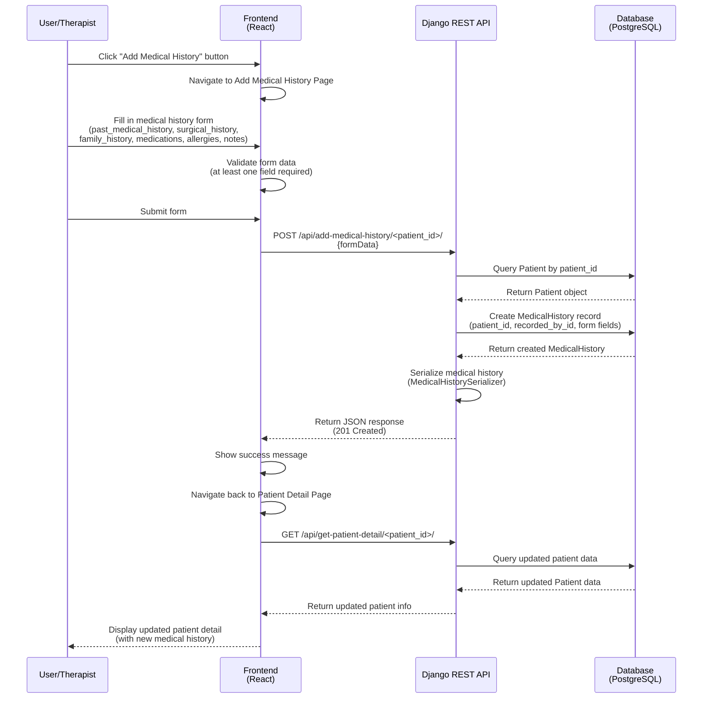
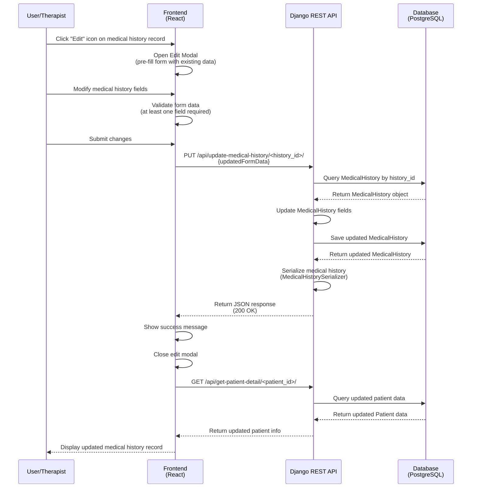
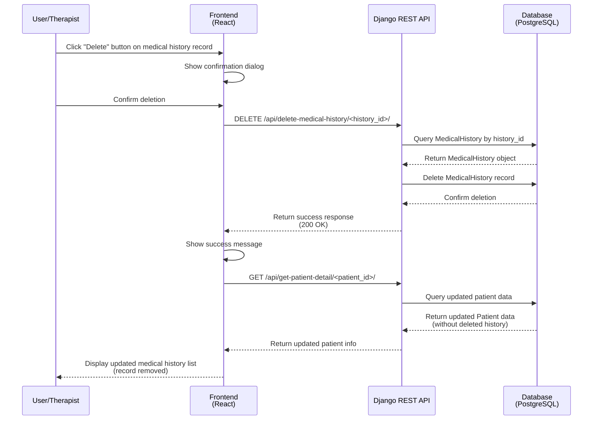

# Patient Information Management Module - Sequence Diagrams

## 1. View Patient Detail

```mermaid
sequenceDiagram
    participant User as User/Therapist
    participant Frontend as Frontend<br/>(React)
    participant API as Django REST API
    participant DB as Database<br/>(PostgreSQL)

    User->>Frontend: Navigate to Patient Detail Page
    Frontend->>Frontend: Extract patientId from route params
    Frontend->>API: GET /api/get-patient-detail/<patient_id>/
    API->>DB: Query Patient with medical_histories
    DB-->>API: Return Patient data
    API->>API: Serialize patient data<br/>(PatientHistorySerializer)
    API-->>Frontend: Return JSON response<br/>(patient info, medical histories)
    Frontend->>Frontend: Update state with patient data
    Frontend-->>User: Display patient detail page<br/>(Profile, Medical History, Treatments, Appointments)
```

## 2. Create New Medical History

```mermaid
sequenceDiagram
    participant User as User/Therapist
    participant Frontend as Frontend<br/>(React)
    participant API as Django REST API
    participant DB as Database<br/>(PostgreSQL)

    User->>Frontend: Click "Add Medical History" button
    Frontend->>Frontend: Navigate to Add Medical History Page
    User->>Frontend: Fill in medical history form<br/>(past_medical_history, surgical_history,<br/>family_history, medications, allergies, notes)
    Frontend->>Frontend: Validate form data<br/>(at least one field required)
    User->>Frontend: Submit form
    Frontend->>API: POST /api/add-medical-history/<patient_id>/<br/>{formData}
    API->>DB: Query Patient by patient_id
    DB-->>API: Return Patient object
    API->>DB: Create MedicalHistory record<br/>(patient_id, recorded_by_id, form fields)
    DB-->>API: Return created MedicalHistory
    API->>API: Serialize medical history<br/>(MedicalHistorySerializer)
    API-->>Frontend: Return JSON response<br/>(201 Created)
    Frontend->>Frontend: Show success message
    Frontend->>Frontend: Navigate back to Patient Detail Page
    Frontend->>API: GET /api/get-patient-detail/<patient_id>/
    API->>DB: Query updated patient data
    DB-->>API: Return updated Patient data
    API-->>Frontend: Return updated patient info
    Frontend-->>User: Display updated patient detail<br/>(with new medical history)
```

## 3. Update Medical History

```mermaid
sequenceDiagram
    participant User as User/Therapist
    participant Frontend as Frontend<br/>(React)
    participant API as Django REST API
    participant DB as Database<br/>(PostgreSQL)

    User->>Frontend: Click "Edit" icon on medical history record
    Frontend->>Frontend: Open Edit Modal<br/>(pre-fill form with existing data)
    User->>Frontend: Modify medical history fields
    Frontend->>Frontend: Validate form data<br/>(at least one field required)
    User->>Frontend: Submit changes
    Frontend->>API: PUT /api/update-medical-history/<history_id>/<br/>{updatedFormData}
    API->>DB: Query MedicalHistory by history_id
    DB-->>API: Return MedicalHistory object
    API->>API: Update MedicalHistory fields
    API->>DB: Save updated MedicalHistory
    DB-->>API: Return updated MedicalHistory
    API->>API: Serialize medical history<br/>(MedicalHistorySerializer)
    API-->>Frontend: Return JSON response<br/>(200 OK)
    Frontend->>Frontend: Show success message
    Frontend->>Frontend: Close edit modal
    Frontend->>API: GET /api/get-patient-detail/<patient_id>/
    API->>DB: Query updated patient data
    DB-->>API: Return updated Patient data
    API-->>Frontend: Return updated patient info
    Frontend-->>User: Display updated medical history record
```

## 4. Delete Medical History

```mermaid
sequenceDiagram
    participant User as User/Therapist
    participant Frontend as Frontend<br/>(React)
    participant API as Django REST API
    participant DB as Database<br/>(PostgreSQL)

    User->>Frontend: Click "Delete" button on medical history record
    Frontend->>Frontend: Show confirmation dialog
    User->>Frontend: Confirm deletion
    Frontend->>API: DELETE /api/delete-medical-history/<history_id>/
    API->>DB: Query MedicalHistory by history_id
    DB-->>API: Return MedicalHistory object
    API->>DB: Delete MedicalHistory record
    DB-->>API: Confirm deletion
    API-->>Frontend: Return success response<br/>(200 OK)
    Frontend->>Frontend: Show success message
    Frontend->>API: GET /api/get-patient-detail/<patient_id>/
    API->>DB: Query updated patient data
    DB-->>API: Return updated Patient data<br/>(without deleted history)
    API-->>Frontend: Return updated patient info
    Frontend-->>User: Display updated medical history list<br/>(record removed)
```

